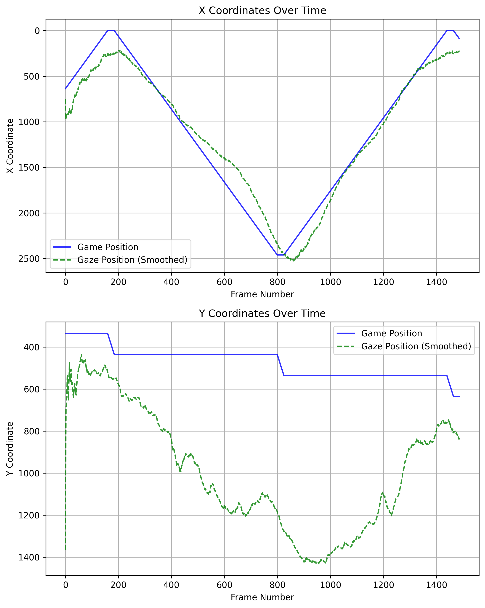
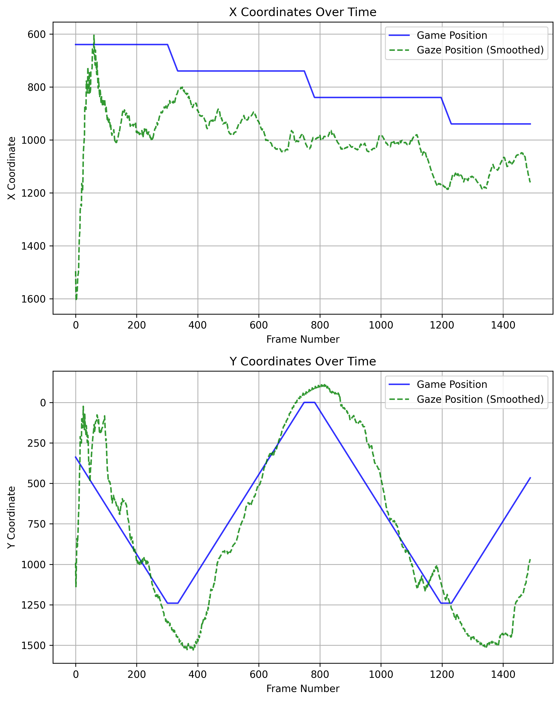
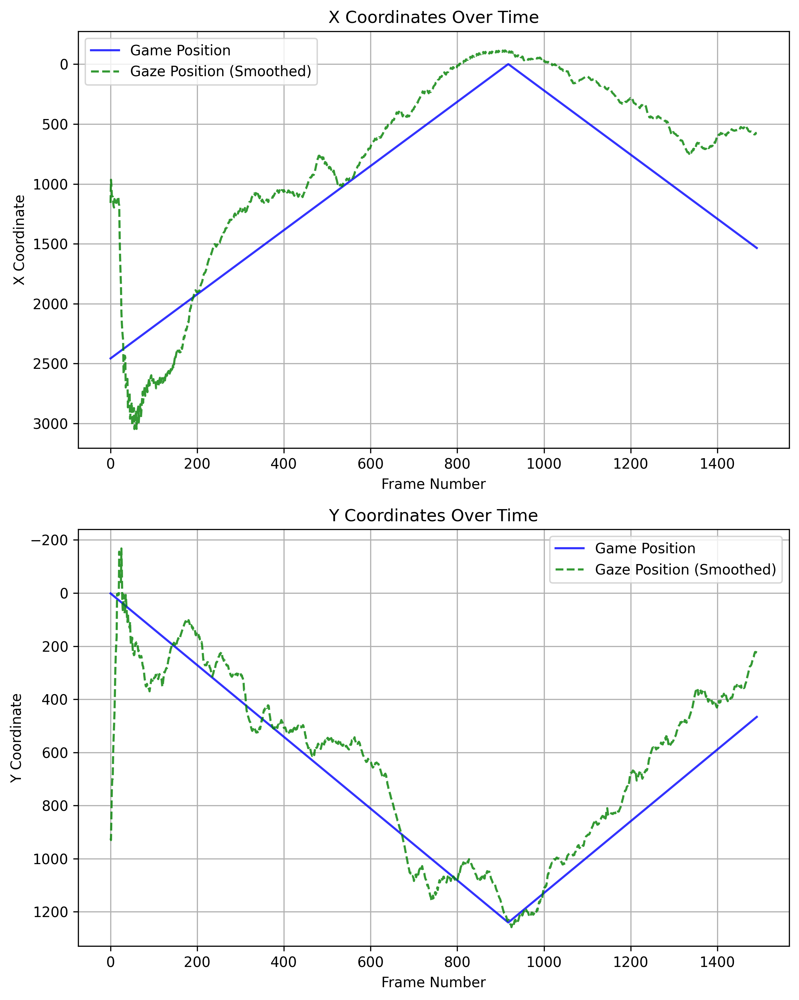

## Assessing Visual Tracking in Children With Special Needs

A cost-effective eye-tracking tool that enables therapists to evaluate and enhance visual tracking abilities in children with special needs without the need for specialized hardware

### System Architecture


The system consists of a client-side system that runs an interactive game and captures the eye movements of the child through a webcam. The captured video along with CSV file containing the coordinates of the object movement in the game is then uploaded to the server. In the server, the video is processed using a deep learning model to extract the eye gaze vector which is then translated to screen coordinates and saved in a CSV file. The object coordinates are then compared with the gaze coordinates to derive meaningful insights about the child's visual tracking abilities.

### System Requirements

The client-side system, used by the child, must consist of a standard
computer equipped with an octa-core processor, 8 GB of RAM, a
1080p webcam capable of recording at 30 frames per second, and a
25-inch Full HD display. The server-side system should include a 32-
core CPU, 16 GB or more of RAM, at least 8 GB of GPU memory to
support advanced processing tasks and sufficient storage capacity,
with a minimum of 1 TB. These requirements ensure seamless inte-
gration between the client and server systems, facilitating effective
remote monitoring and analysis.

### Usage

Install the required packages using the `requirements.txt` file and download the pre-trained gaze estimation models from [here](https://drive.google.com/drive/folders/17p6ORr-JQJcw-eYtG2WGNiuS_qVKwdWd?usp=sharing) and store it to *models/*.

```python
# To launch the game for video capture run
python game_interface.py
```

```python
# To process the video and generate insights, run the following command
streamlit run ui.py
```

```python
# To run inference on a image
python inference.py --image_path assets/input_image.png
```

```python
# To run inference on a video file
python inference.py --video_path assets/video.mp4
```

```python
# To run inference on webcam with cam id 0
python inference.py --cam 0
```

### Results

The results of experiment conducted on seven participants are presented in the following table:

| Metric        | Horizontal  | Vertical    | Diagonal    |
| ------------- | ----------- | ----------- | ----------- |
| Correlation X | 0.97 ± 0.01 | 0.58 ± 0.26 | 0.94 ± 0.03 |
| Correlation Y | 0.33 ± 0.46 | 0.84 ± 0.05 | 0.83 ± 0.13 |
| Gaze Jitter   | 0.13 ± 0.06 | 0.11 ± 0.08 | 0.21 ± 0.16 |

Plot depicting actual movement of object in game and predicted gaze trajectory in x and y axis

|  |  |  |
| :----------------------------------: | :------------------------------: | :------------------------------: |
|       (a) Horizontal movement        |      (b) Vertical movement       |      (c) Diagonal movement       |

### References

- [L2CS-Net: Fine-Grained Gaze Estimation in Unconstrained Environments](http://arxiv.org/abs/2203.03339)
- [Automatic generation and detection of highly reliable fiducial markers under occlusion](https://doi.org/10.1016/j.patcog.2014.01.005)
- [A new approach to linear filtering and prediction problems](<>)
